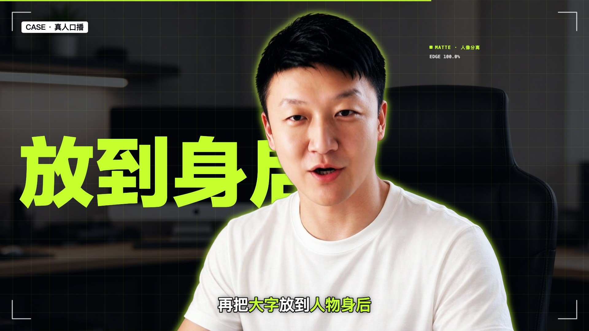

# xingor-video-skill

一个 Claude Code Skill：把一段**口播 / talking-head 视频**自动剪成科技感十足的 16:9 成片。



## 效果

- **文字在人物背后**：AI 抠像（RobustVideoMatting）后，大字落在人物身后
- **MG / 演示动画**：流程图、步骤列表、数据卡片、数字人 vs 真人点阵对比、Skill 打包动画等 18 个镜头模板
- **口播小窗（TalkCard）**：人物放进竖向圆角 ON AIR 卡片，可从全屏缩成小窗，在右侧 / 左侧 / 圆形气泡之间弹簧变形移动，跟随人脸裁切；支持浅色纸面和深色两种主题
- **深色科技场景**：人物抠出缩到右侧，带荧光绿描边光，左侧放演示动画
- **逐字对齐的字幕**：Whisper 转写 + 关键词荧光绿高亮
- **剪辑**：自动缩短停顿、推拉镜头、故障 / 斜切光带转场
- **音效**：whoosh、重击、弹出、上升音等全部程序合成，跟动画同步；可选 BGM 自动避让人声

风格：深墨色背景 + 荧光柠檬绿（#C6FF2E）点缀，"NEON LAB"。

## 安装

```bash
git clone https://github.com/imokya/xingor-video-skill.git ~/.claude/skills/xingor-video-skill
```

装好后在 Claude Code 里直接说：

> 帮我把 `口播.mp4` 剪辑一下，加字幕和特效，用 xingor 风格

Claude 会按 [SKILL.md](SKILL.md) 的流程自动完成：环境安装 → 视频分析 → 修字幕 → 规划镜头 → 静帧检查 → 渲染成片。

## 手动使用

```bash
# 1. 一次性环境（venv、ffmpeg、抠像模型）
bash scripts/setup.sh work
cd work

# 2. 分析视频：标准化、转写、找停顿、逐帧抠像、检测人物位置
.venv/bin/python ../scripts/analyze.py ../口播.mp4

# 3. 修改 captions.txt（一行对应一段，用 | 切分字幕），
#    参照 references/example_project/scenes.py 写 scenes.py

# 4. 静帧预览（秒为单位）→ 完整渲染
.venv/bin/python ../scripts/render.py test 3.5 12 30
.venv/bin/python ../scripts/render.py full ../成片_v1.mp4 --bgm music.mp3
```

## 目录

```
SKILL.md                         Skill 主说明（工作流）
references/style-guide.md        风格规范 + 镜头模板选择表
references/example_project/      93 秒示例视频的完整镜头代码与字幕
scripts/setup.sh                 环境安装
scripts/analyze.py               视频分析（ASR / 停顿 / 抠像 / 人物定位）
scripts/components.py            18 个可复用镜头模板（含口播小窗）
scripts/fx.py                    绘图与缓动工具（skia）
scripts/render.py                合成渲染 + 音频（剪停顿、音效、BGM）
scripts/montage.py               静帧拼图
```

## 依赖

- Python 3.11、torch、faster-whisper、skia-python、imageio-ffmpeg（`setup.sh` 自动安装）
- macOS 字体：苹方、兰亭黑、Avenir Next Condensed、DIN Condensed、Menlo
  （其他系统请修改 `scripts/fx.py` 里的 `FAM` 字体映射）
- 渲染速度：M1 Pro 约 13 fps，90 秒视频约 3 分钟
